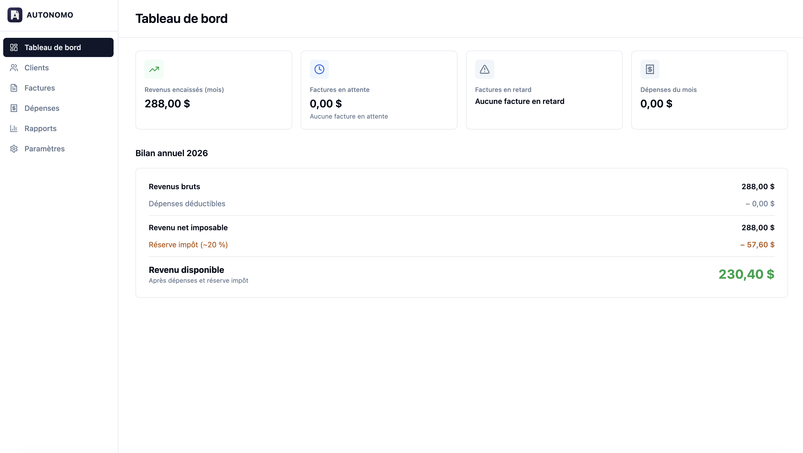
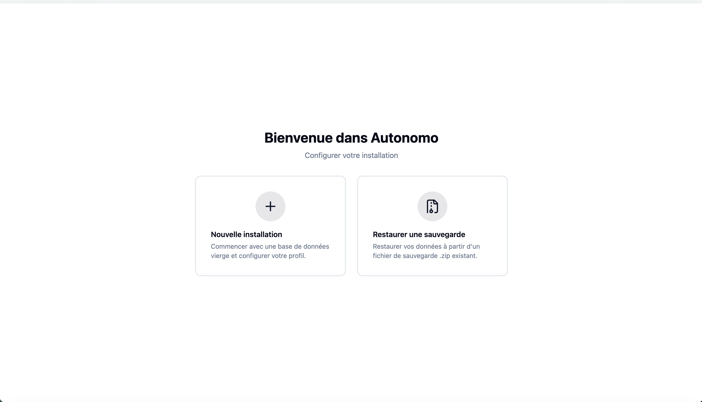
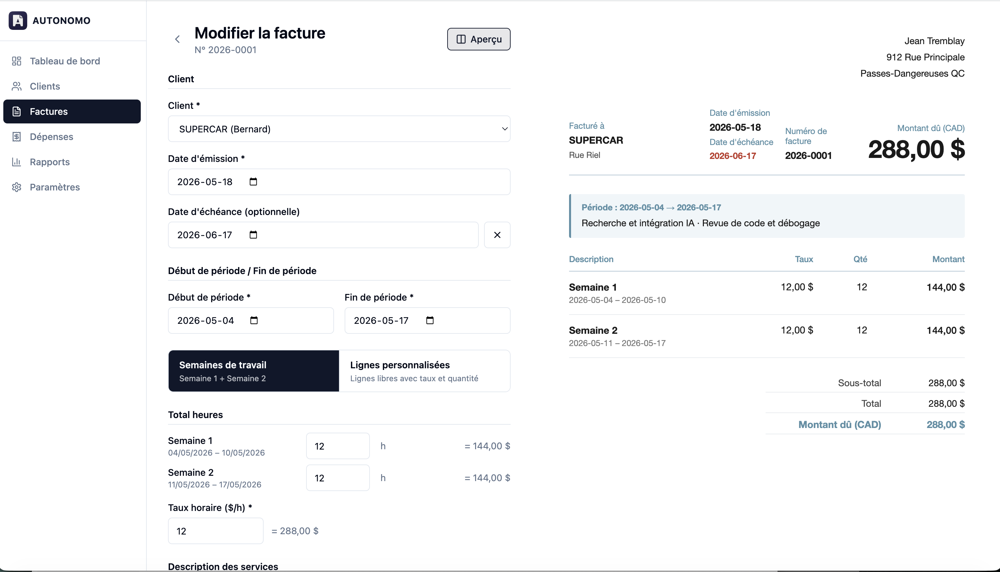

# Autonomo

**Facturation locale pour travailleurs autonomes au Québec — pensée d'abord pour
les étudiants internationaux à permis d'études.**

Autonomo est une application de bureau qui permet de gérer ses clients, d'émettre
des factures conformes à Revenu Québec, de suivre ses paiements et ses dépenses
d'entreprise, et de préparer sa déclaration de revenus annuelle. Tout reste en
local sur la machine — aucune synchronisation cloud, aucune donnée qui sort.

L'interface est en **français (fr-CA)** par défaut, avec l'anglais (en-CA) en option.



## À qui s'adresse Autonomo

**Public principal — étudiants internationaux avec permis d'études.**
Un permis d'études encadre strictement le travail autorisé. Pour cette raison,
Autonomo rend les **heures travaillées** et la **période de travail**
*obligatoires sur chaque facture* : chaque facture devient une preuve de
conformité réutilisable. Ces champs ne peuvent jamais être masqués ni rendus
optionnels.

**Mais utilisable par tout travailleur autonome.**
L'éditeur de facture propose deux modes :

- **Semaines de travail** — Semaine 1 + Semaine 2, heures et période détaillées.
  Le mode conformité permis d'études.
- **Lignes personnalisées** — lignes libres avec description, taux et quantité.
  Une facturation classique pour n'importe quel pigiste, sans la contrainte des
  semaines de travail.

## Aperçu

| Premier lancement | Éditeur de facture |
| --- | --- |
|  |  |

## Fonctionnalités

- **Clients** — CRUD complet, facturation horaire ou forfaitaire, archivage
- **Factures** — deux modes d'édition (semaines de travail / lignes
  personnalisées), aperçu en direct, numérotation séquentielle, génération PDF
  (Puppeteer), pièces justificatives des heures
- **Cycle de vie** — statut de document (brouillon / émise / annulée) et statut
  de paiement calculé (impayée / partielle / payée / créditée)
- **Paiements** — paiements complets ou partiels avec preuve jointe
- **Dépenses** — suivi par catégorie, taux de déductibilité, reçus
- **Tableau de bord** — revenus encaissés du mois, factures en attente et en
  retard, bilan annuel avec revenu net imposable, réserve d'impôt estimée et
  revenu disponible
- **Rapports** — revenus sur base d'encaissement, rapport fiscal annuel,
  exports PDF / CSV
- **Sauvegarde** — sauvegarde locale automatique en `.zip` et restauration

## Conformité Québec

Chaque facture respecte les exigences de Revenu Québec : nom et adresse de
l'émetteur, nom et adresse du client, numéro de facture séquentiel, date,
description du service, quantité (heures), prix unitaire (taux horaire) et
montant total. La TPS et la TVQ sont désactivées par défaut (revenu sous le
seuil de 30 000 $/an) et peuvent être activées facture par facture.

## Stack technique

| Domaine          | Technologie                          |
| ---------------- | ------------------------------------ |
| Application      | Electron + Vite + React + TypeScript |
| UI               | shadcn/ui + Tailwind CSS             |
| État global      | Jotai                                |
| Base de données  | Drizzle ORM + better-sqlite3         |
| PDF              | Puppeteer (gabarits HTML/CSS)        |
| i18n             | i18next + react-i18next              |
| Sauvegarde       | adm-zip                              |

## Prérequis

- Node.js 20+
- npm

## Démarrage

```bash
npm install        # installe et recompile better-sqlite3 pour Electron
npm run dev         # lance l'application en mode développement
```

## Scripts

| Commande              | Description                              |
| --------------------- | ---------------------------------------- |
| `npm run dev`         | Lance l'app en mode développement        |
| `npm run build`       | Build de production dans `out/`          |
| `npm run typecheck`   | Vérification TypeScript (`tsc --noEmit`) |
| `npm run build:mac`   | Génère l'installeur macOS                |
| `npm run build:win`   | Génère l'installeur Windows              |
| `npm run build:linux` | Génère l'installeur Linux                |

## Structure du projet

```
electron/        Processus principal Electron, preload et handlers IPC
db/              Schéma Drizzle et migrations SQLite
src/
  pages/         Pages par module (dashboard, clients, invoices, ...)
  components/    Composants UI (shadcn) et partagés
  store/         Atomes Jotai
  locales/       Fichiers de traduction fr / en
templates/       Gabarits HTML/CSS des factures
docs/            Captures d'écran et documentation
```

## Données utilisateur

Les données sont stockées dans `~/Documents/Autonomo/` : base de données
SQLite, pièces jointes et sauvegardes. Aucune donnée ne quitte la machine.

## Développement assisté par IA

Une partie du code de ce projet a été produite avec l'assistance d'outils d'IA
générative, utilisés comme support de développement. L'IA n'est pas autonome :
elle travaille sous la direction, la supervision et la revue de l'auteur,
**Armya Bakouan**, développeur logiciel et React fort de 4 ans d'expérience.

L'architecture, les décisions techniques, les choix métier et la validation
finale du code relèvent entièrement de l'auteur. L'IA accélère la mise en œuvre ;
l'expertise humaine garde la responsabilité du résultat.

## Licence

GNU General Public License v3.0 ou ultérieure — voir le fichier [`LICENSE`](LICENSE).

Le code est libre et ouvert. Toute version modifiée et distribuée doit rester
sous licence GPL.
